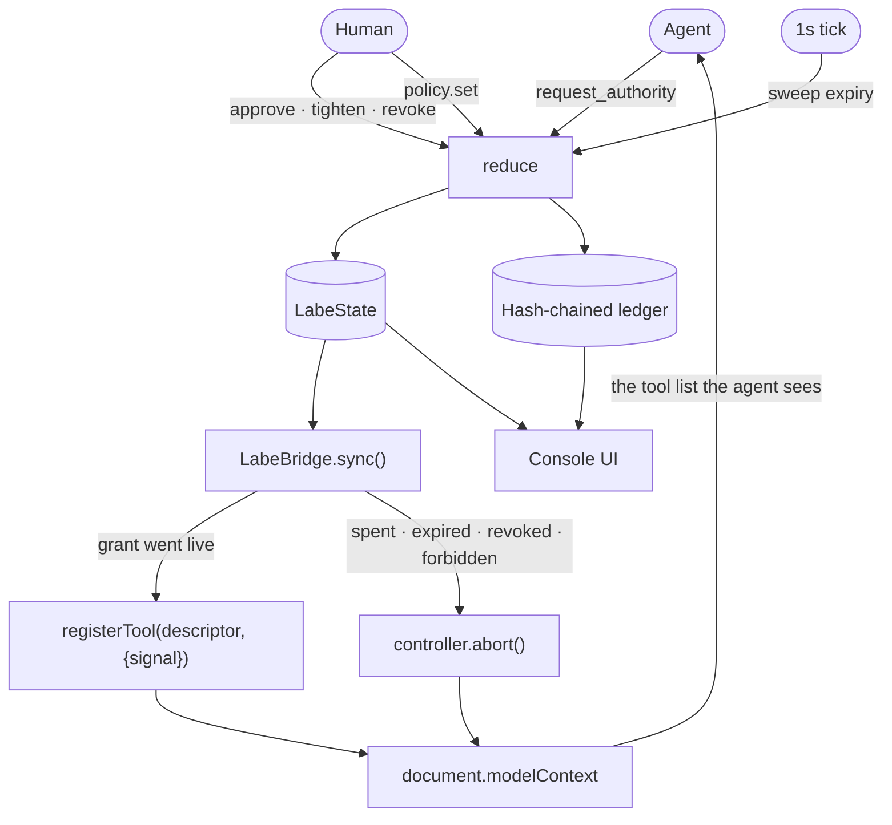
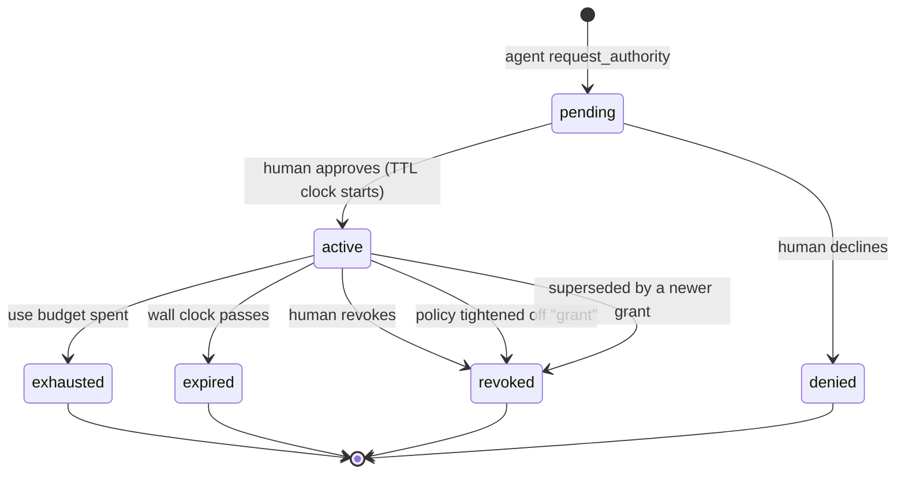

# Architecture

Four layers, one rule: **the DOM is a view, never the source of truth.**

```
Presentation   components/*.tsx        React. Reads state, dispatches Actions.
Interface      lib/webmcp/*            registerTool, schemas, the clock.
Domain         lib/domain/*            Pure. No React, no DOM, synchronous.
State          store.ts + localStorage One reducer, one ledger.
```

A click and a WebMCP `execute` both build an `Action` and call `reduce`. There
is no second code path for agents — which is the only honest way to claim the
human and the agent share one system.

---

## The mechanism



The loop that matters: a human decision changes state, state changes the
registered tool surface, and the tool surface *is* what the agent can do.
`sync()` is about thirty lines and it is the entire product.

## Authorising one call

```mermaid
sequenceDiagram
  participant A as Agent
  participant B as LabeBridge
  participant D as reduce
  participant Z as authorize
  participant L as Ledger

  A->>B: rollback_deploy(dpl_9c1f)
  Note over B: not registered — no grant is live
  B-->>A: "not registered; request authority first"

  A->>B: request_authority(rollback_deploy, dpl_9c1f, reason)
  B->>D: grant.request
  D->>L: grant.request ok
  D-->>A: pending — a human must approve

  Note over A: poll check_authority, do not retry a missing tool

  A->>B: rollback_deploy(dpl_9c1f, reason)
  B->>D: op.execute (actor=agent)
  D->>Z: policy? grant? pins? caps?
  Z-->>D: allowed, grantId=gr_0004
  D->>D: apply · consume grant
  D->>L: op.rollback_deploy ok
  D-->>B: rolled back 9c1f4ab to 7a30de2
  Note over B: grant exhausted, sync() aborts the controller
  B-->>A: tool gone from the surface
```

The human approval step between the request and the call is deliberately not
drawn as a message to the agent. Nobody tells the agent it was approved; the
tool simply exists on its next attempt.

## The authorisation decision

`authorize(state, operationId, params, now, actor)` in
[`authority.ts`](../lib/domain/authority.ts), in order:

| # | Check | Denial code |
|---|---|---|
| 1 | Operation exists | `unknown_operation` |
| 2 | Required params present, types coercible | `missing_param` / `bad_param` |
| 3 | Value within the product's own hard ceiling | `hard_max_exceeded` |
| 4 | *Human or system caller → allowed. The console is their authority.* | — |
| 5 | Standing policy is not `forbidden` | `policy_forbidden` |
| 6 | Standing policy `auto` → allowed | — |
| 7 | A live grant covers this operation **and** this resource | `authority_absent` |
| 8 | Pinned parameters match the grant exactly | `pin_violation` |
| 9 | Numeric arguments within the grant's ceilings | `cap_exceeded` |

Order is load-bearing. Hard ceilings are checked before grants, so a grant can
only ever narrow authority — never widen it past what the product allows.

Step 4 is why the same reducer can serve both actors. A human in their own
console is not gated by grants; grants exist to bound a *delegate*.

## Grant lifecycle



Only `active` produces a registered tool. Everything else is absence.

The TTL clock starts on **approval**, not on request — a request sitting in the
inbox overnight does not burn its own window.

**At most one live grant per operation.** Two would mean two tools competing for
one name and an ambiguous ledger: which authority did that call spend? A second
approval supersedes the first and records `grant.superseded`.

## Capability as JSON Schema

`schemaFor(op, grant)` compiles a grant into the schema the agent is handed, so
the capability is legible rather than discovered by failing:

```ts
// no grant: not registered at all.

// with grant gr_0004 on dpl_9c1f:
{
  type: "object",
  properties: {
    deployId: {
      type: "string",
      const: "dpl_9c1f",           // pinned — cannot name another deploy
      enum: ["dpl_9c1f"],
      description: "... Pinned to dpl_9c1f by grant gr_0004."
    },
    reason: { type: "string", description: "Why the rollback is warranted." }
  },
  required: ["deployId", "reason"],
  additionalProperties: false
}
```

A `scale_service` grant capped at 8 replicas emits `maximum: 8`, clamped against
the operation's own `hardMax: 64`. The description names the grant and its
expiry timestamp — an absolute time rather than a countdown, so it does not go
stale between registration and use.

## Why the domain layer is synchronous

The ledger is hash-chained, and the chain is written from inside reducers. Web
Crypto's `digest` is async, which would have forced every reducer and every
`execute` to become async for no product reason. So
[`sha256.ts`](../lib/domain/sha256.ts) is a compact synchronous SHA-256,
verified against the FIPS 180-4 vectors.

The payoff: reducers are pure `(state, action) => { state, result }`, testable
in Node with no mocks, no fake timers and no async plumbing. Every test passes a
`now` explicitly, which is why expiry behaviour is testable at all.

## Where WebMCP-specific code lives

| File | Responsibility |
|---|---|
| [`webmcp/types.ts`](../lib/webmcp/types.ts) | Ambient types; `probeModelContext()` for both globals |
| [`webmcp/bridge.ts`](../lib/webmcp/bridge.ts) | Descriptors, `schemaFor`, `sync()`, result shaping |
| [`webmcp/useConsole.ts`](../lib/webmcp/useConsole.ts) | Store + bridge + the 1 s clock |

Nothing outside `lib/webmcp/` imports `modelContext`, and nothing inside
`lib/domain/` knows WebMCP exists. Swapping in a different agent transport would
touch one directory.

## Persistence and reload

State is JSON in `localStorage` under `labe.console.v1`. On load, malformed or
missing state falls back to the seeded incident. The ledger is re-verified on
render, so a hand-edited store shows as a broken chain rather than silently
passing.

The console renders only after mount. Grant expiry is wall-clock and the seed is
built relative to `Date.now()`, so a server-rendered snapshot of a live tool
surface would be wrong the instant it arrived.
